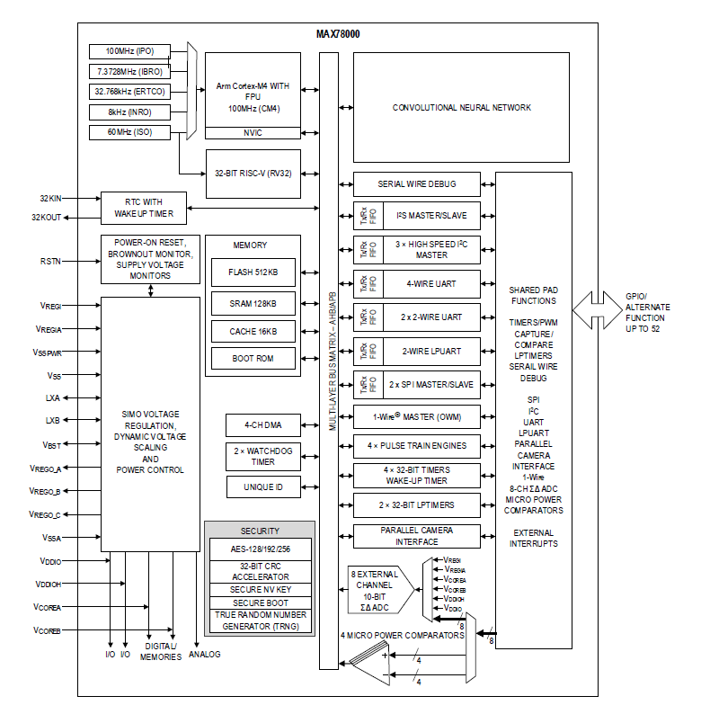

# Introduction

!!! info Preliminary
    The MAX78000 User Guide on this website is **preliminary**. To access the full document, refer to [MAX7800 User Guide](https://www.analog.com/media/en/technical-documentation/user-guides/max78000-user-guide.pdf) 

The MAX78000 is a new breed of low-power microcontrollers built to thrive in the rapidly evolving AI at the edge market. These products include Maxim's proven ultra-low-power MCU IP along with deep neural network AI acceleration.

The MAX78000 is an advanced system-on-chip featuring an Arm® Cortex®-M4 with FPU CPU to efficiently compute complex functions and algorithms with integrated power management. It also includes a 442KB weight CNN accelerator. The devices offer large on-chip memory with 512KB flash and up to 128KB SRAM. Multiple high-speed and low-power communications interfaces are supported, including high-speed SPI, I2C serial interface, and LPUART. Additional low-power peripherals include flexible low-power timers (LPTMR) and analog comparators.

The high-level block diagram for the MAX78000 is shown in [Figure 2-1](#figure2-1).

*Figure 2-1: MAX78000 Block Diagram*

